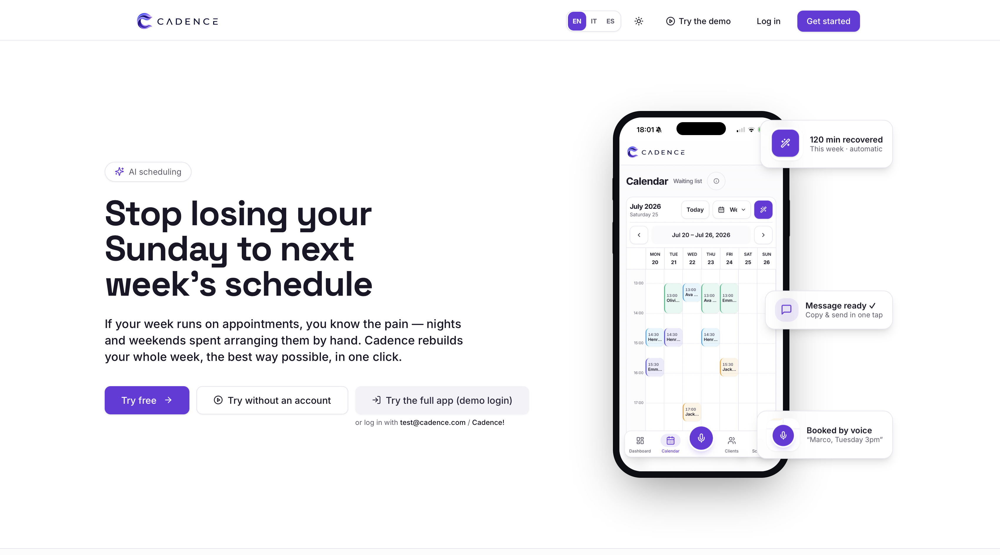
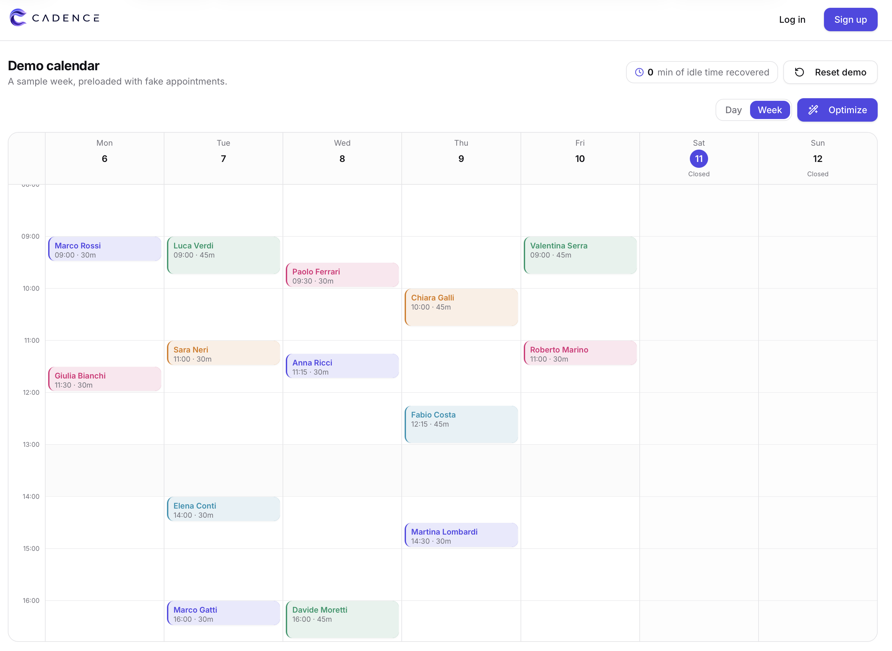
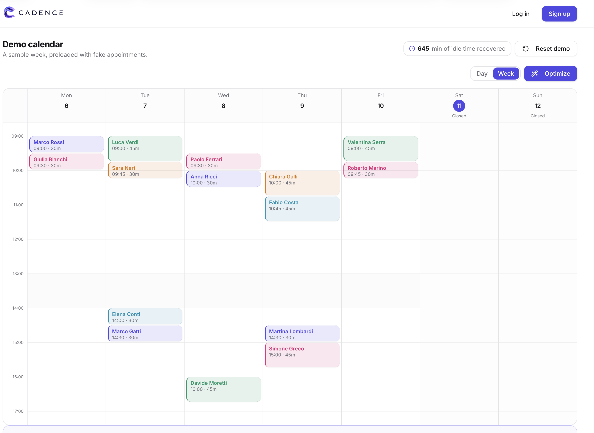
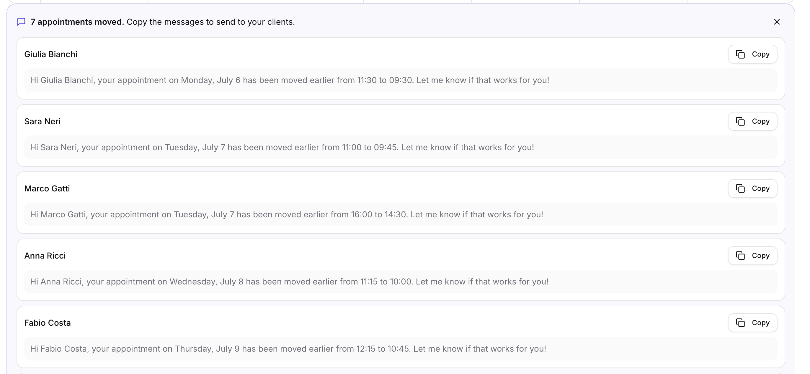
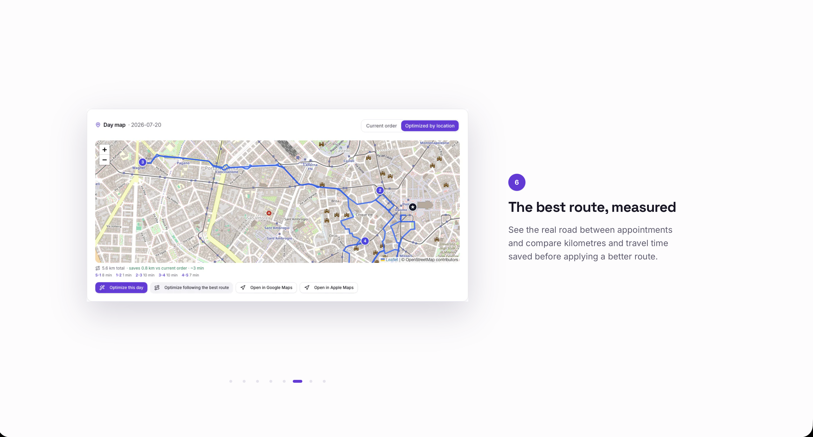

# Cadence

A smart scheduling and calendar optimization platform designed for service-based businesses and independent professionals.

Cadence helps organize appointments, manage clients and optimize daily schedules through a modern and intuitive interface.

## Preview

## Features

- Appointment and calendar management
- Client and service organization
- Smart schedule optimization
- Waiting list management
- Natural-language scheduling commands
- Responsive desktop and mobile interface
- Progressive Web App support

## Tech Stack

- Next.js
- React
- TypeScript
- Tailwind CSS
- Supabase
- Framer Motion

## About the Project

Cadence was created as a modern scheduling experience for professionals who manage appointments, clients and changing availability.

The project explores how intelligent automation, clear visual design and scheduling constraints can work together to simplify calendar management.

## Status

Cadence is currently a functional prototype and is being developed as a personal product and portfolio project.